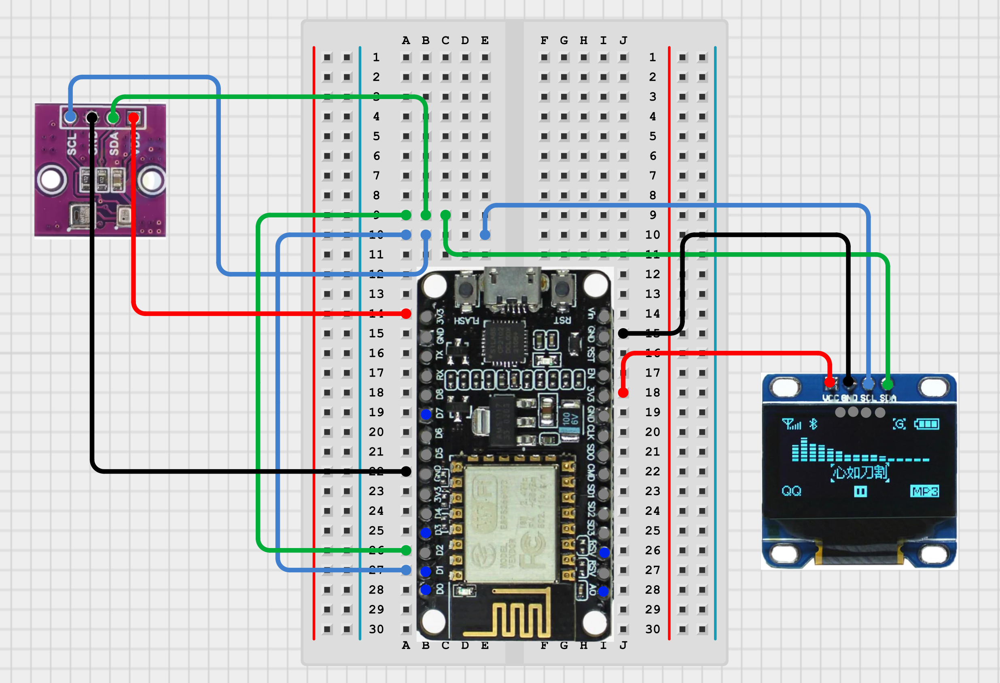

# 🌡️ ESP8622 Weather Station [](https://opensource.org/licenses/MIT)

## 📋 Overview

This project allows to use NodeMCU v3 board to create a simple weather station, which reads temperature, humidity, and atmospheric pressure from two I2C sensors.

The output is rendered on small OLED screen, and optionally published to an MQTT broker. This can be useful for integration with home automation systems, dashboards, or logging tools.

Update on screen and MQTT broker happens in 2 second manner, which is configurable in `config.h` file.

> **Note**: The same should code work for ESP32 boards, with minor tweaks (change of used library for Wi-Fi) and changes in pinout. Moreover, ESP32 exposes more I2C lines, making the wiring easier, without need to parallelize.

## ✨ Features

- Temperature and humidity readings via **AHT20** sensor,
- Atmospheric pressure readings via **BMP280** sensor,
- Live output on **SSD1306** OLED display (128x64 resolution),
- Multi-language display UI support (currently: English/Polish),
- Ability to publish current sensor data over MQTT on local network.

## 🛠️ Used hardware

| Component                   | Model                                |
| --------------------------- | ------------------------------------ |
| Microcontroller             | **NodeMCU v3** (ESP8266, CP2106)     |
| Temperature/humidity sensor | **AHT20**                            |
| Pressure sensor             | **BMP280**                           |
| Display                     | **SSD1306** OLED, 128x64, white, I2C |

All peripherals share a single I2C bus. The **ESP8266** controller exposes only one hardware I2C controller, but since each device uses a distinct address, all three can be wired to the same SDA/SCL lines without any conflict.

> **Note**: The hardware listed above reflects my own build. It is not a strict requirement, and can be changed (e.g. separate sensors instead of combo module).

## 🔌 Wiring



> **Note**: Diagram shows a module that combines AHT20/BMP280 sensors together, sharing a single SDA/SCL line.

| Signal | NodeMCU Pin | Color on diagram |
| ------ | ----------- | ---------------- |
| SDA    | **D2**      | Green            |
| SCL    | **D1**      | Blue             |
| VCC    | **3V3**     | Red              |
| GND    | **GND**     | Black            |

NodeMCU v3 exposes few 3V3 and GND pins, so there is no need to connect in them serial.

### I2C Addresses

| Device      | Address (`hex`) | Notes                                           |
| ----------- | --------------- | ----------------------------------------------- |
| **AHT20**   | `0x38`          | _none_                                          |
| **BMP280**  | `0x77`          | Some use `0x76` based on resistor configuration |
| **SSD1306** | `0x3C`          | _none_                                          |

## ⚙️ Requirements

- **[PlatformIO](https://platformio.org/)** (VS Code extension or CLI)
- **An MQTT broker** reachable via local network (or one hosted outside, reachable within) (e.g. [Mosquitto](https://mosquitto.org/))

## 🛠️ Configuration

Before flashing, set desired values in `include/config.h`:

```cpp
#define WIFI_SSID "YOUR_SSID"
#define WIFI_PASS "YOUR_PASSWORD"

#define MQTT_HOST "192.168.x.x" // MQTT broker address
#define MQTT_PORT 1883

#define ENABLE_MQTT true // set to false to networking
#define APP_LANGUAGE "en" // "en" or "pl"
```

Current config contains default values, so change them as you wish. You can disable publication of readouts via MQTT using `ENABLE_MQTT` flag.

## 🚀 Build and flash

You can use CLI commands, or VS Code extension to flash the firmware to the controller:

```bash
pio run -t upload
pio device monitor
```

### 🐛 Debugging

If everything was configured correctly, board after boot will immediately start to send messages via serial port.  
You can read them to monitor and troubleshoot, for e.g. connection to Wi-Fi, connection to MQTT broker, etc.

Default project's set baud rate is `74880`, which can be changed in `platformio.ini` and inside `main.cpp`'s `init()` function.

To connect the serial monitor, you can use one of ways briefly described below:

1. **Via terminal**
   ```bash
   pio device list
   pio device monitor --port PORT --baud 74880
   ```
2. **VS Code extension** - `"F1 > PlatformIO: Serial Monitor"`
3. **Connect via [putty](https://putty.org/index.html)** or other serial monitor software.

## 📁 Project structure:

```
include/
  config.h              # Wi-Fi, MQTT, pin and language config
  sensors.h
  display_handler.h
  network_handler.h
  helpers.h
  language.h
src/
  main.cpp              # main loop, module orchestration
  sensors.cpp           # AHT20+BMP280 reading logic
  display_handler.cpp   # OLED rendering
  network_handler.cpp   # Wi-Fi + MQTT handling
  helpers.cpp           # helper functions
  language.cpp          # string translations
```

## 📡 MQTT Topics

Currently there are three topics for each readout from sensor.  
Topic paths can be configured in `config.h`.

| Topic                      | Description                 |
| -------------------------- | --------------------------- |
| `home/station/temperature` | Temperature in °C           |
| `home/station/humidity`    | Relative humidity in %      |
| `home/station/pressure`    | Atmospheric pressure in hPa |

Readings can be inspected using [MQTT Explorer](https://mqtt-explorer.com/) or from a terminal:

```bash
mosquitto_sub -h 192.168.x.x -t "home/station/#" -v
```

Current implementation publishes the data only if snapshot from last readout changed, this way eliminating redundant messages on topics.

## 📜 License

This project alone is licensed under the [MIT License](https://github.com/nogiszd/esp-weather-station/blob/main/LICENSE.txt/).

Below is the table of used libraries and their respective licenses:

| Used library                                                                   | Used license                                                                               |
| ------------------------------------------------------------------------------ | ------------------------------------------------------------------------------------------ |
| [Adafruit AHTX0](https://github.com/adafruit/Adafruit_AHTX0)                   | [BSD](https://github.com/adafruit/Adafruit_AHTX0/blob/master/license.txt)                  |
| [Adafruit BMP280 Library](https://github.com/adafruit/Adafruit_BMP280_Library) | [MIT License](https://github.com/adafruit/Adafruit_BMP280_Library/blob/master/LICENSE.txt) |
| [Adafruit SSD1306](https://github.com/adafruit/Adafruit_SSD1306)               | [BSD](https://github.com/adafruit/Adafruit_SSD1306/blob/master/license.txt)                |
| [Adafruit GFX Library](https://github.com/adafruit/Adafruit-GFX-Library)       | [BSD](https://github.com/adafruit/Adafruit-GFX-Library/blob/master/license.txt)            |
| [Adafruit BusIO](https://github.com/adafruit/Adafruit_BusIO/)                  | [MIT License](https://github.com/adafruit/Adafruit_BusIO/blob/master/LICENSE)              |
| [arduino-mqtt](https://github.com/256dpi/arduino-mqtt)                         | [MIT License](https://github.com/256dpi/arduino-mqtt/blob/master/LICENSE.md)               |
